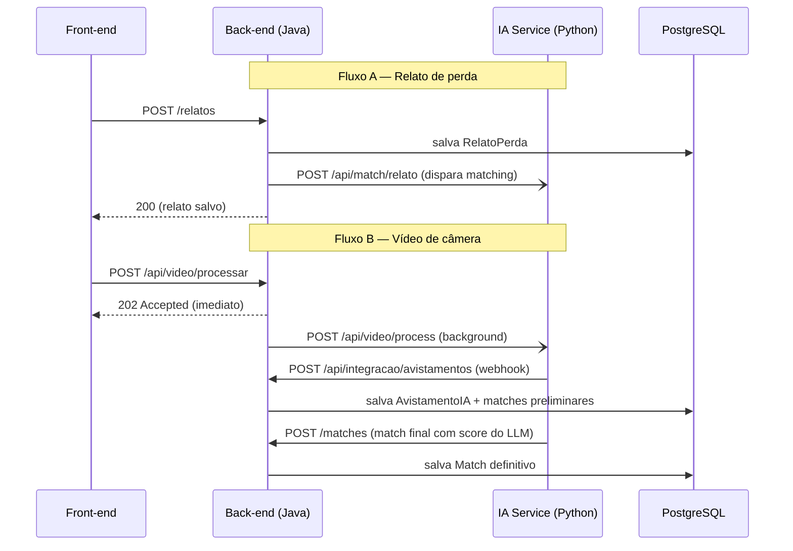

# 1. Arquitetura e Visão Geral

[← Voltar ao índice](./README.md)

---

## 1.1. Papel do back-end na plataforma

O CãoRadar segue uma **arquitetura de microsserviços**. O back-end Java/Spring Boot documentado aqui é o **serviço transacional**: ele é a fonte da verdade sobre o estado do sistema e o ponto de coordenação entre o front-end e a inteligência artificial.

Responsabilidades:

- **Persistir** usuários, relatos de perda, câmeras, avistamentos e matches no PostgreSQL.
- **Expor a API REST** consumida pelo front-end Angular.
- **Orquestrar o IA Service** (microsserviço cognitivo em Python): dispara o processamento de vídeo e o matching, e recebe de volta os resultados.
- **Aplicar a pré-filtragem barata** (por raça e geolocalização) antes de acionar a IA mais cara, economizando chamadas ao modelo generativo.

> O **reconhecimento visual em si** (detecção com YOLOv8 e classificação/comparação com agentes Agno + Gemini) **não acontece neste serviço** — ele vive no IA Service Python. O back-end conversa com ele por HTTP.

---

## 1.2. Componentes da plataforma

| Componente | Tecnologia | Responsabilidade |
|------------|-----------|------------------|
| **Front-end** | Angular / TypeScript | Interface do tutor e painel admin |
| **Back-end** (este) | Java 21 / Spring Boot | Estado, regras de negócio, orquestração |
| **IA Service** | Python (YOLOv8 + Agno/Gemini) | Detecção em vídeo, extração de features, cálculo de similaridade |
| **Banco de dados** | PostgreSQL (relacional + JSONB) | Persistência |
| **Hospedagem do IA Service** | Hugging Face Spaces | Execução do microsserviço cognitivo |

---

## 1.3. Arquitetura em camadas (dentro do back-end)

O serviço adota a estratificação clássica do Spring Boot. Cada requisição percorre as camadas de cima para baixo:

```
        HTTP (JSON)
            │
            ▼
┌───────────────────────┐
│      Controller        │  Recebe requisições REST, valida entrada, devolve ResponseEntity
│  (camada de borda)     │  → ver doc 3 (API REST)
└───────────┬───────────┘
            ▼
┌───────────────────────┐
│       Service          │  Regras de negócio, transações, orquestração da IA
│  (camada de domínio)   │  → ver doc 4 (Serviços e Fluxos)
└───────────┬───────────┘
            ▼
┌───────────────────────┐
│      Repository         │  Acesso a dados (Spring Data JPA) + queries customizadas
│  (camada de dados)     │  → ver doc 2 (Modelo de Dados)
└───────────┬───────────┘
            ▼
┌───────────────────────┐
│   Model (Entidades)    │  Mapeamento objeto-relacional (Hibernate)
└───────────┬───────────┘
            ▼
        PostgreSQL
```

Há ainda dois pacotes transversais:

- **`config`** — beans de infraestrutura (ex.: `RestClientConfig`, que expõe o `RestTemplate` usado para falar com o IA Service).
- **`SecurityConfig`** — configuração de CORS e Spring Security (ver [doc 5](./05-seguranca-e-config.md)).

---

## 1.4. Integração com o IA Service

A comunicação entre back-end e IA Service é **bidirecional** e totalmente assíncrona do ponto de vista do usuário. Toda a base é a variável de ambiente **`IA_API_URL`** (default `http://localhost:8000`).



Pontos-chave dessa integração:

1. **Resiliência:** as chamadas do back-end para o IA Service são embrulhadas em `try/catch`. Se a IA estiver fora do ar, a operação principal (ex.: criar um relato) **nunca falha** — apenas o matching deixa de ser disparado.
2. **Não bloqueio:** o processamento de vídeo retorna **`202 Accepted`** na hora e roda em *background* (`CompletableFuture.runAsync`), porque a IA pode levar 60–120 s. Isso evita timeout no front-end.
3. **Webhook de volta:** o IA Service devolve resultados por dois endpoints — `/api/integracao/avistamentos` (novo avistamento detectado) e `/matches` (match final com score e justificativa do LLM).

Os detalhes de cada fluxo estão na [doc 4 — Serviços e Fluxos](./04-servicos-e-fluxos.md).

---

## 1.5. Observabilidade — proxy de logs

O back-end também expõe um **proxy de logs** (`/admin/ia-logs` e `/admin/ia-logs/stream`) que busca, em tempo real, os logs de execução do IA Service hospedado no **Hugging Face Spaces**. Isso permite que o painel admin acompanhe o processamento da IA sem acesso direto ao HF. A implementação (cache, deduplicação e SSE) está descrita na [doc 4](./04-servicos-e-fluxos.md#46-hflogsservice--proxy-de-logs-da-ia).

---

[← Índice](./README.md) · [Próximo: Modelo de Dados →](./02-modelo-de-dados.md)
