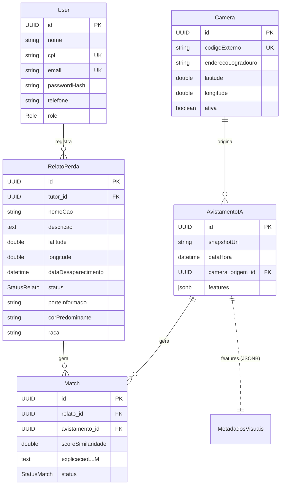

# 2. Modelo de Dados

[← Anterior: Arquitetura](./01-arquitetura.md) · [Índice](./README.md)

---

O modelo de dados é mapeado com **JPA/Hibernate** sobre o PostgreSQL. Todas as entidades herdam de uma superclasse comum (`BaseEntity`) e o esquema é gerado/atualizado automaticamente pelo Hibernate (`spring.jpa.hibernate.ddl-auto=update`).

## 2.1. Diagrama de entidades e relacionamentos



> A entidade auxiliar de fotos (`tb_relato_fotos`) é uma **coleção de elementos** (`@ElementCollection`) de `RelatoPerda` — uma tabela secundária que guarda a lista de URLs de fotos de cada relato.

---

## 2.2. `BaseEntity` — superclasse comum

`@MappedSuperclass` que padroniza identidade e auditoria de todas as entidades:

| Campo | Tipo | Geração |
|-------|------|---------|
| `id` | `UUID` | `@GeneratedValue(strategy = UUID)` — chave primária gerada automaticamente |
| `createdAt` | `LocalDateTime` | `@CreationTimestamp` — preenchido na inserção (imutável) |
| `updatedAt` | `LocalDateTime` | `@UpdateTimestamp` — atualizado a cada alteração |

O uso de **UUID** (em vez de `long` sequencial) evita enumeração de IDs e facilita a geração distribuída de chaves entre serviços.

---

## 2.3. Entidades

### `User` — tabela `tb_users`
Representa o tutor (ou administrador) do sistema.

| Campo | Restrições | Observações |
|-------|-----------|-------------|
| `nome` | obrigatório | |
| `cpf` | único, obrigatório | normalizado para somente dígitos no `UserService` |
| `email` | único, obrigatório | usado como identificador de login |
| `passwordHash` | obrigatório | ⚠️ no protótipo, a senha é comparada em texto plano (ver [doc 5](./05-seguranca-e-config.md)) |
| `telefone` | opcional | canal de contato do tutor |
| `role` | enum `Role` | `ADMIN` ou `TUTOR` |

### `RelatoPerda` — tabela `tb_relatos_perda`
O registro de um cão perdido feito pelo tutor. É o lado "consulta" do matching.

| Campo | Tipo | Observações |
|-------|------|-------------|
| `tutor` | `@ManyToOne User` | dono do relato (`tutor_id`) |
| `nomeCao` | string | obrigatório |
| `descricao` | text | descrição livre |
| `fotosUrl` | `@ElementCollection` | lista de URLs de fotos (tabela `tb_relato_fotos`) |
| `latitude` / `longitude` | double | local do desaparecimento (usado na busca geoespacial) |
| `dataDesaparecimento` | datetime | default: momento da criação |
| `status` | enum `StatusRelato` | ciclo de vida do relato |
| `porteInformado`, `corPredominante`, `raca` | string | **metadados de filtro rápido**, usados para pré-selecionar candidatos antes da IA |

### `Camera` — tabela `tb_cameras`
Câmera de monitoramento que origina avistamentos.

| Campo | Restrições | Observações |
|-------|-----------|-------------|
| `codigoExterno` | único, obrigatório | identificador lógico (ex.: `CAM-01`) usado nas integrações |
| `enderecoLogradouro` | opcional | descrição do ponto |
| `latitude` / `longitude` | double | base geográfica do avistamento |
| `ativa` | boolean (default `true`) | filtra câmeras em operação |

### `AvistamentoIA` — tabela `tb_avistamentos_ia`
Um cão detectado pela IA em um frame de vídeo. É o lado "evidência" do matching.

| Campo | Tipo | Observações |
|-------|------|-------------|
| `snapshotUrl` | string (obrigatório) | URL do frame capturado |
| `dataHora` | datetime | momento do avistamento |
| `cameraOrigem` | `@ManyToOne Camera` | câmera que gerou o avistamento |
| `features` | **JSONB** (`MetadadosVisuais`) | atributos visuais extraídos pela IA — ver §2.4 |

### `Match` — tabela `tb_matches`
A ponte entre um relato e um avistamento — o resultado central do sistema.

| Campo | Tipo | Observações |
|-------|------|-------------|
| `relato` | `@ManyToOne RelatoPerda` | obrigatório |
| `avistamento` | `@ManyToOne AvistamentoIA` | obrigatório |
| `scoreSimilaridade` | double | nota de similaridade (0.0 em matches preliminares; preenchida pelo LLM no match final) |
| `explicacaoLLM` | text | justificativa textual gerada pela IA |
| `status` | enum `StatusMatch` | decisão do usuário sobre o match |

---

## 2.4. Persistência híbrida — `MetadadosVisuais` (JSONB)

`MetadadosVisuais` **não é uma entidade** — é um POJO serializável persistido como coluna **`jsonb`** dentro de `AvistamentoIA`, via `@JdbcTypeCode(SqlTypes.JSON)`. Isso combina o melhor dos dois mundos: a estrutura relacional do avistamento e a **flexibilidade de esquema** para os atributos que a IA retorna.

```json
{
  "racaEstimada": "Golden Retriever",
  "corPredominante": "Caramelo",
  "porteEstimado": "Grande",
  "confiancaDetecao": 0.94,
  "caracteristicasExtras": ["coleira vermelha", "orelhas caídas"]
}
```

| Campo | Tipo | Origem |
|-------|------|--------|
| `racaEstimada` | string | classificação de raça pela IA |
| `corPredominante` | string | cor predominante do pelo |
| `porteEstimado` | string | porte (pequeno/médio/grande) |
| `confiancaDetecao` | double | confiança da detecção |
| `caracteristicasExtras` | lista de string | traços fenotípicos adicionais |

> Esse JSON é exatamente o payload produzido pelo IA Service Python e recebido pelo webhook `/api/integracao/avistamentos`.

---

## 2.5. Enums (máquinas de estado)

### `Role`
`ADMIN` · `TUTOR`

### `StatusRelato` — ciclo de vida do relato
| Valor | Significado |
|-------|-------------|
| `EM_BUSCA` | padrão ao criar; cão ainda procurado |
| `ENCONTRADO` | tutor confirmou um match |
| `ARQUIVADO` | encerrado por tempo ou cancelamento |

### `StatusMatch` — decisão sobre o match
| Valor | Significado |
|-------|-------------|
| `PENDENTE_ANALISE` | aguardando avaliação do tutor |
| `CONFIRMADO_PELO_USUARIO` | tutor reconheceu o cão |
| `REJEITADO_PELO_USUARIO` | tutor descartou o avistamento |

---

## 2.6. Repositórios (Spring Data JPA)

Cada entidade central tem um repositório que estende `JpaRepository`. Além dos métodos CRUD herdados, há *derived queries* e *queries* JPQL customizadas:

| Repositório | Métodos relevantes | Para que serve |
|-------------|--------------------|----------------|
| `UserRepository` | `findByEmail`, `existsByEmail` | login e checagem de unicidade |
| `CameraRepository` | `findByCodigoExterno`, `countByAtivaTrue` | vincular avistamento à câmera física |
| `RelatoPerdaRepository` | `findByTutor`, `findByStatus`, `buscarPorStatusERaca`, **`buscarPorRaio`**, `buscarComFiltros` | seleção de candidatos para matching |
| `AvistamentoIARepository` | `findByCameraOrigemAndDataHoraAfter` | consultas por câmera/janela de tempo |
| `MatchRepository` | `findByRelatoOrderByScoreSimilaridadeDesc`, `findByRelatoAndStatus`, `deleteByRelato` | listar/limpar matches de um relato |

### Destaque: busca geoespacial por raio (fórmula de Haversine)

A query `buscarPorRaio` calcula, em JPQL, a distância entre o local de desaparecimento e a câmera usando a **fórmula de Haversine** (raio da Terra = 6371 km), retornando apenas relatos `EM_BUSCA` dentro do raio informado:

```sql
SELECT r FROM RelatoPerda r WHERE r.status = 'EM_BUSCA' AND
  (6371 * acos(cos(radians(:lat)) * cos(radians(r.latitude)) *
   cos(radians(r.longitude) - radians(:lon)) +
   sin(radians(:lat)) * sin(radians(r.latitude)))) < :raioKm
```

É o **fallback geográfico** do motor de matching, acionado quando a busca por raça não encontra candidatos (ver [doc 4](./04-servicos-e-fluxos.md)).

---

[← Anterior: Arquitetura](./01-arquitetura.md) · [Índice](./README.md) · [Próximo: API REST →](./03-api-rest.md)
