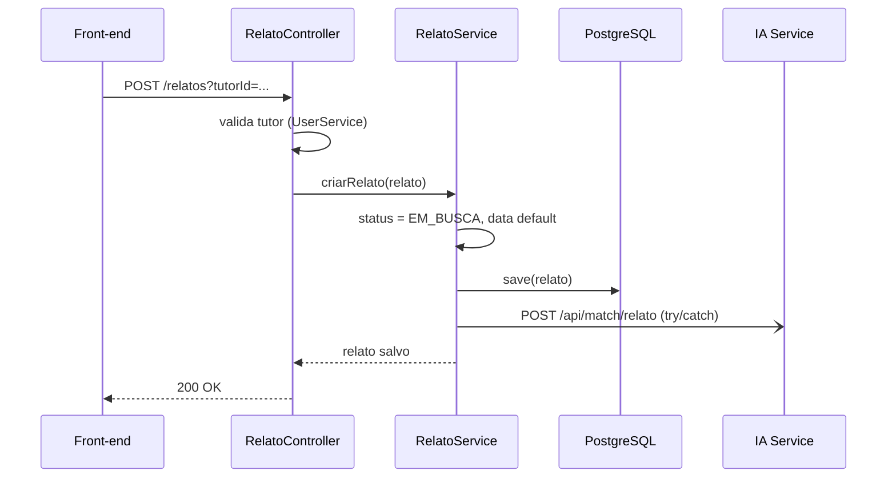
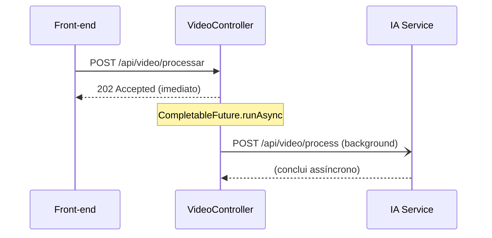
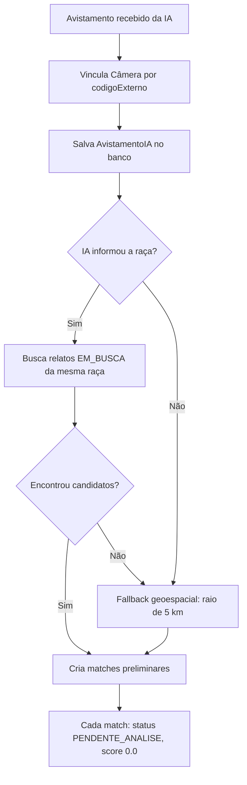
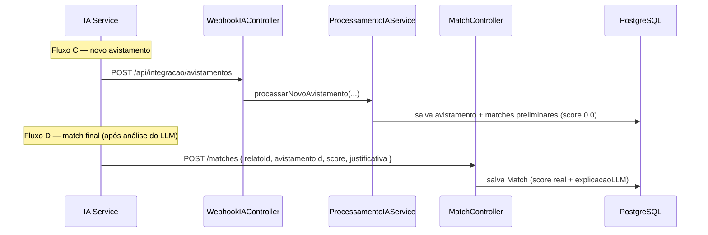

# 4. Serviços e Fluxos de Negócio

[← Anterior: API REST](./03-api-rest.md) · [Índice](./README.md)

---

A camada de **serviço** concentra as regras de negócio e a orquestração da IA. Esta seção descreve cada serviço e, em seguida, costura tudo nos **fluxos ponta a ponta**.

## 4.1. Catálogo de serviços

| Serviço | Responsabilidade |
|---------|------------------|
| `UserService` | Cadastro, normalização de CPF, autenticação |
| `RelatoService` | Criação de relato, ciclo de vida e **disparo do matching na IA** |
| `AvistamentoService` | Consulta filtrada de avistamentos (inclusive dentro do JSONB) |
| `ProcessamentoIAService` | **Motor de matching** acionado pelo webhook da IA |
| `HfLogsService` | Proxy/observabilidade dos logs do IA Service |

---

## 4.2. Fluxo A — Criação de relato e disparo do matching

Quando o tutor registra um cão perdido:

Pontos de design em `RelatoService.criarRelato`:

- O status inicial é forçado para **`EM_BUSCA`** e, se faltar, `dataDesaparecimento` recebe `now()`.
- Após salvar, monta o payload (id, nome, **primeira foto**, raça, porte, cor, descrição, lat/long) e dispara `POST {IA_API_URL}/api/match/relato`.
- A chamada está em **`try/catch`**: se a IA falhar, loga o erro mas **retorna o relato salvo mesmo assim**. A persistência nunca depende da disponibilidade da IA.

A exclusão de relato (`excluirRelato`) é **`@Transactional`** e remove primeiro os matches (`matchRepository.deleteByRelato`) para respeitar a integridade referencial.

---

## 4.3. Fluxo B — Processamento de vídeo da câmera

`VideoController.processarVideo` devolve **`202` na hora** e delega o trabalho pesado a um `CompletableFuture.runAsync`, montando o payload (`camera_origem_id`, `video_url`, `data_hora`) e chamando o IA Service. Como a IA pode levar 60–120 s, esse desenho **evita timeouts** no front-end.

A partir daí, o IA Service detecta os cães (YOLOv8) e, para cada cão reconhecido, chama de volta o **Fluxo C**.

---

## 4.4. O motor de matching (`ProcessamentoIAService`)

Este é o coração transacional do matching, acionado pelo webhook `/api/integracao/avistamentos`. O método `processarNovoAvistamento` é **`@Transactional`** e executa uma **estratégia em cascata** que economiza chamadas caras à IA:

Detalhamento:

1. **Vínculo da câmera** — `cameraRepo.findByCodigoExterno(codigoCamera)`. Se não existir, segue sem câmera (apenas loga).
2. **Persistência** — define `dataHora = now()` e salva o avistamento (com as `features` em JSONB).
3. **Seleção por raça** — se a IA informou `racaEstimada`, busca relatos `EM_BUSCA` da mesma raça (`buscarPorStatusERaca`, case-insensitive).
4. **Fallback geoespacial** — se a raça não veio ou não houve candidatos, usa a **fórmula de Haversine** (`buscarPorRaio`) para achar relatos a **menos de 5 km** da câmera.
5. **Matches preliminares** — para cada candidato cria um `Match` com `status = PENDENTE_ANALISE`, `score = 0.0` e uma justificativa geográfica. O **score real é preenchido depois** pelo LLM (Fluxo D).

> Esse desenho de duas fases (pré-filtro barato no Java → análise fina na IA) é o que torna o sistema viável sob restrição de orçamento: o modelo generativo só avalia um conjunto já reduzido de candidatos plausíveis.

---

## 4.5. Fluxo C e D — Avistamento e match final vindos da IA

- **Fluxo C** registra a *evidência* (o cão visto na câmera) e gera candidatos preliminares.
- **Fluxo D** registra a *conclusão* da IA: o agente Gemini compara relato × avistamento, atribui um **score de similaridade** e uma **justificativa em linguagem natural**, persistidos pelo `MatchController`.

O tutor então consulta `GET /matches/relato/{id}` (ordenado por score) e decide: ao confirmar, atualiza o `StatusMatch` para `CONFIRMADO_PELO_USUARIO` e o relato para `ENCONTRADO`.

---

## 4.6. `HfLogsService` — proxy de logs da IA

Como o IA Service roda no **Hugging Face Spaces**, o painel admin não tem acesso direto aos seus logs. O `HfLogsService` atua como ponte, em dois modos:

| Modo | Endpoint | Mecanismo |
|------|----------|-----------|
| **Polling** | `GET /admin/ia-logs` | Buffer em memória atualizado quando o cache (TTL 10 s) expira |
| **Streaming** | `GET /admin/ia-logs/stream` | **SSE** re-encaminhando em tempo real o `text/event-stream` do HF |

Características da implementação:

- **Cache com TTL de 10 s** e **deduplicação por SHA-1** da mensagem, para não martelar a API do HF nem repetir linhas.
- **Buffer circular** de até 500 entradas por fonte (`run` e `build`).
- **Estatísticas derivadas** dos logs: total, erros, vídeos processados e matches iniciados (detectados por padrões nas mensagens).
- O modo SSE usa **virtual threads** (`Thread.ofVirtual()`) e **reconecta automaticamente** se o HF fechar a stream.
- Requer as variáveis `HF_TOKEN` e `HF_SPACE_ID` (ver [doc 5](./05-seguranca-e-config.md)). Sem o token, o serviço responde "desabilitado" graciosamente.

---

## 4.7. Resumo: quem chama quem

| Origem | Destino | Endpoint | Quando |
|--------|---------|----------|--------|
| Front-end | Back-end | `POST /relatos` | tutor registra cão perdido |
| Back-end | IA Service | `POST /api/match/relato` | logo após salvar o relato |
| Front-end | Back-end | `POST /api/video/processar` | envio de vídeo de câmera |
| Back-end | IA Service | `POST /api/video/process` | em background |
| IA Service | Back-end | `POST /api/integracao/avistamentos` | cão detectado no vídeo |
| IA Service | Back-end | `POST /matches` | match final com score do LLM |
| Painel admin | Back-end | `GET /admin/ia-logs[/stream]` | observabilidade |

---

[← Anterior: API REST](./03-api-rest.md) · [Índice](./README.md) · [Próximo: Segurança e Configuração →](./05-seguranca-e-config.md)
