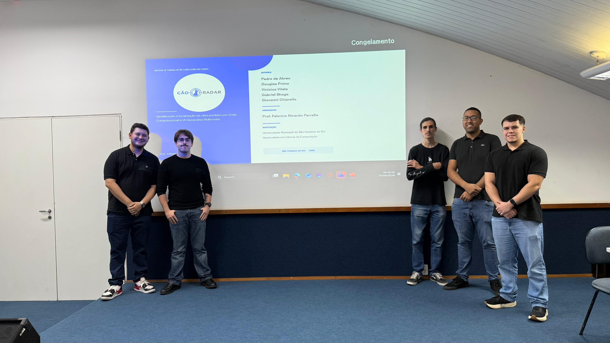

# 📚 CãoRadar

Neste diretório, você encontra a monografia completa do nosso Trabalho de Conclusão de Curso (TCC), detalhando toda a pesquisa, as decisões arquiteturais e o desenvolvimento do ecossistema CãoRadar.

📥 **Leia o documento completo:** [tcc-caoradar-final.pdf](./tcc-caoradar-final.pdf)

---

## 🤝 O Time por trás do Código

A construção de um ecossistema envolvendo Visão Computacional, IA Generativa Multimodal e uma arquitetura robusta de microsserviços só foi possível graças à dedicação deste time:

